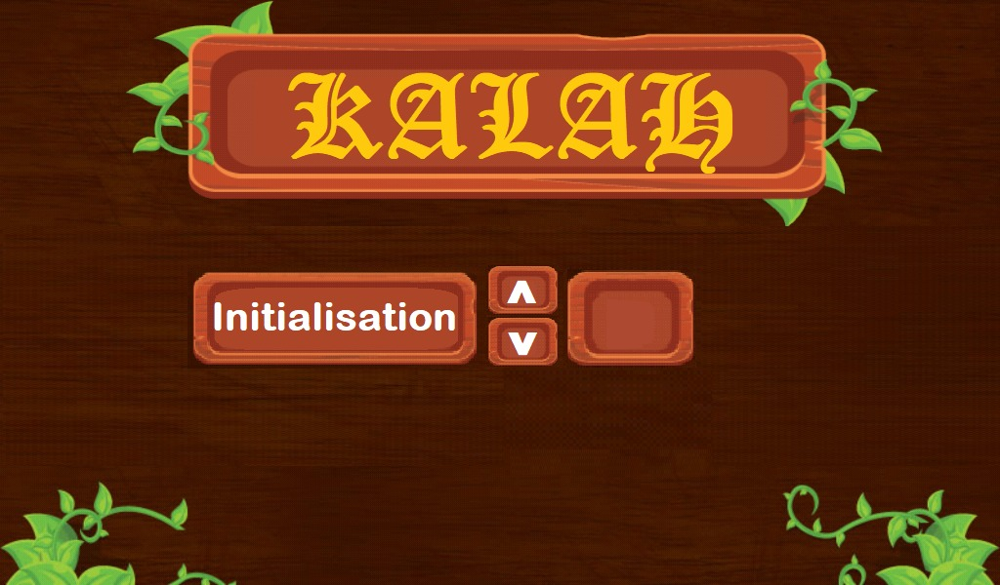
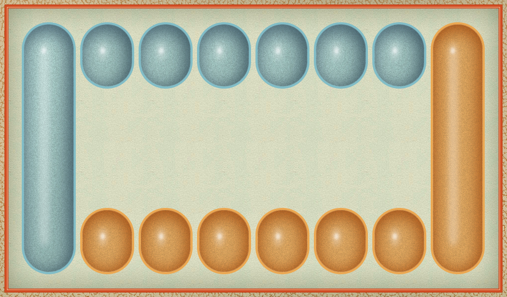
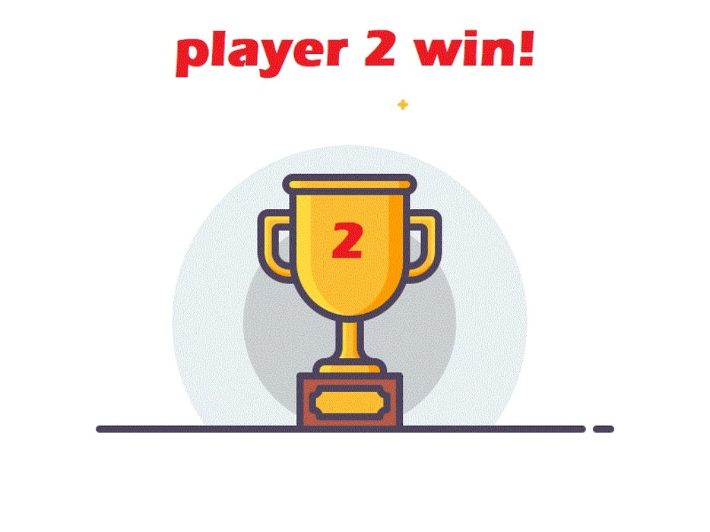

# kalah_game
>Kalah or Mankalah game in c using sdl.

## Presentation 
`Kalah` is a game in which each user tries to get the maximum of score in the main hole (Kalah). 
At each time the player has to find which hole to choose so that the pieces in there will be distributed equaly and sequentiely on each hole of the board. Also one have to think of the best choice carefully so that he or she won't give a bonus score to the oponent.

1. The game start by showing the main options board to the player:

2. Then the player can initiate the number of pieces in all the holes of the board so that the game start:

3. The game start then and the user can choose a hole by clicking it:

4. Finally the smarter wins!

</img></img>

***

### Befor you use this code remember...
      please remember that you need to set up you work space so that you can use sdl2 and sdl ttf and sdl image.

