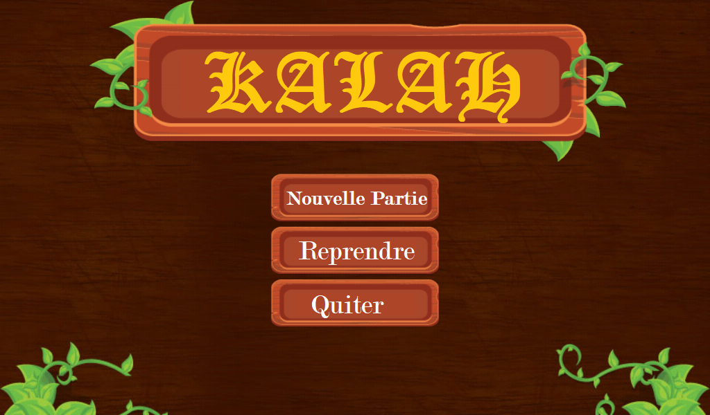
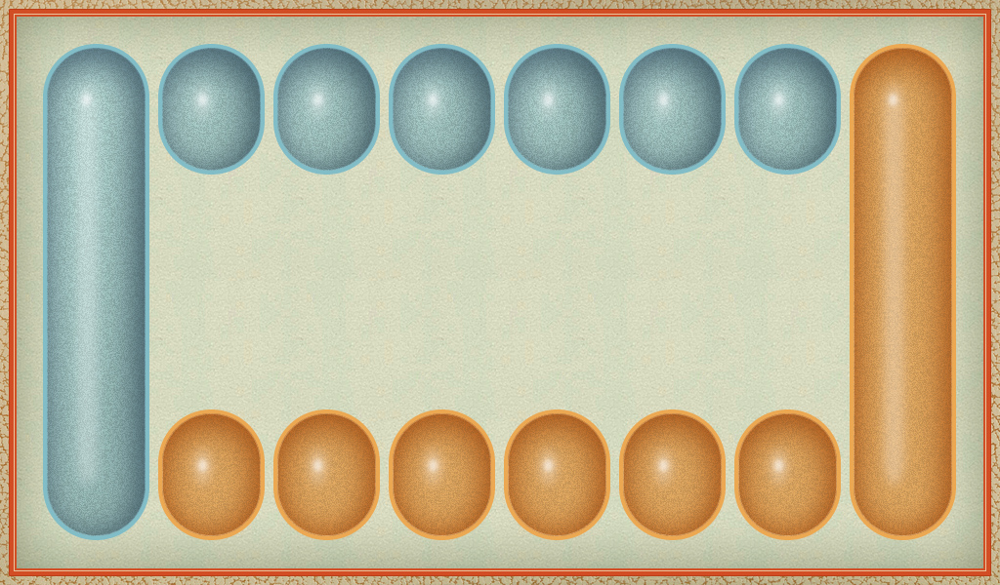
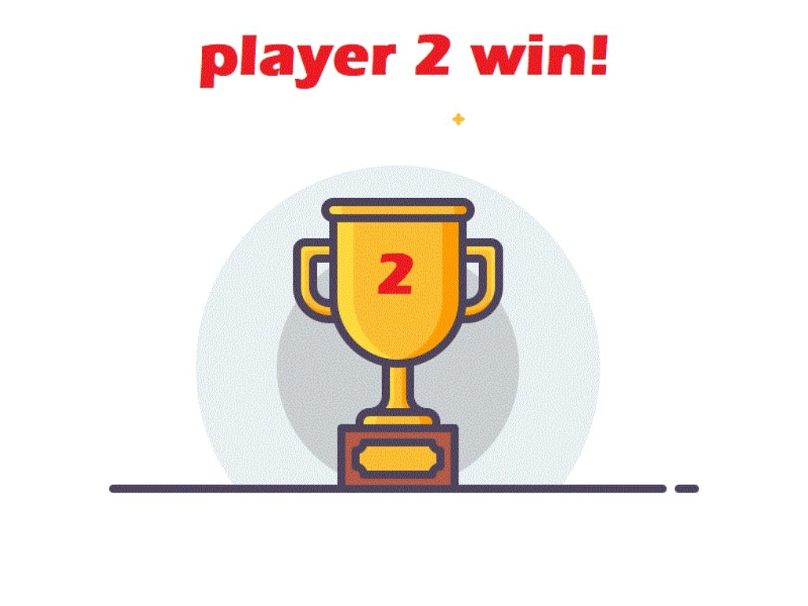

# kalah_game
>Kalah or Mankalah game in c using sdl.

## Presentation 
`Kalah` is a game in which each user tries to get the maximum of score in the main hole (Kalah). 
At each time the player has to find which hole to choose so that the pieces in there will be distributed equaly and sequentiely on each hole of the board. Also one have to think of the best choice carefully so that he or she won't give a bonus score to the oponent.

1. The game start by showing the main options board to the player:

2. Then the player can initiate the number of pieces in all the holes of the board so that the game start:

3. The game start then and the user can choose a hole by clicking it:

4. Finally the smarter wins!


<p align="center">
      
      
</p>

***

### Befor you use this code remember...
Please remember that you need to set up you work space so that you can use sdl2 and sdl ttf and sdl image.

***

### How to run this code

It is simple to understand the Makefile commands. They follow one pattern:

```sh
$ make command
``` 
The commands in the Makefile are: all, clean and so on. However, they depend on the os you are using. So read the Makefile. After building the project you can run it using the launch.json file if you were using vscode. Otherwise run it like this:

```sh
$ ./kalah
``` 
Remember to create a directory obj. Also, create a directory src/include and put the sdl librairies there, if you didn't install them globaly.